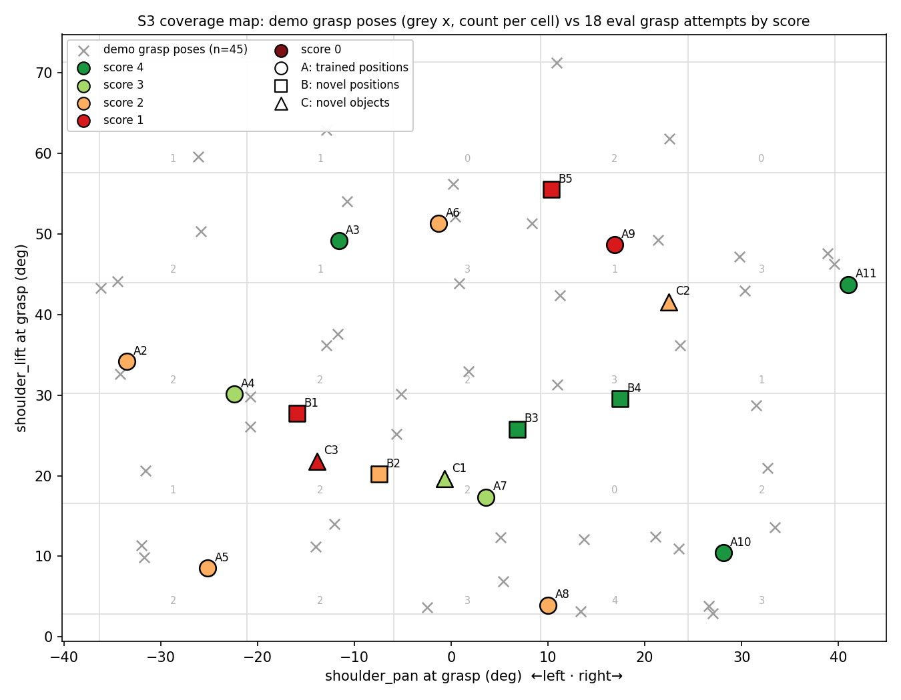
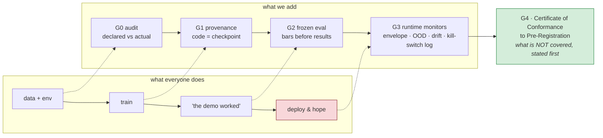

# ARM-ANI — measurement-first robotics on a $200 arm

 · model [`anikmall/smolvla_pick_red_v1`](https://huggingface.co/anikmall/smolvla_pick_red_v1) · dataset [`anikmall/armani_pick_red_v1`](https://huggingface.co/anikmall/armani_pick_red_v1) · evidence index [`docs/EVIDENCE_INDEX.md`](docs/EVIDENCE_INDEX.md)

**The question this repo answers:** when a learned robot policy is evaluated, what can actually be *proved* about it — and what was only *believed*? One SO-101 desk arm, 50 hand-recorded demonstrations, a fine-tuned vision-language-action model, a live evaluation with its protocol fixed before trial 1, and every claim graded by the evidence behind it. Where a finding didn't survive measurement, the correction is published with the same prominence as the result.

This is the workshop where a robot-data audit practice was built: every check we now run on other people's training data was earned from a failure here first. The next layer — a publicly pre-registered, certified deployment on this same arm — is in progress (see [Current work](#current-work)).

## The loop, in one picture

```mermaid
flowchart LR
    A["<b>1 · Record</b><br/>50 teleop episodes<br/>marked 5×5 grid, C920"] --> B["<b>2 · Audit the corpus</b><br/>declared vs measured<br/>gripper ≤ 63% of range<br/>pick-AND-place, not pick"]
    B --> C["<b>3 · Fine-tune</b><br/>SmolVLA 450M, 20k steps<br/>config vs checkpoint diffed"]
    C --> D["<b>4 · Evaluate</b><br/>protocol fixed before trial 1<br/>18 trials · 0–4 ladder<br/>baseline aborted, not faked"]
    D --> E["<b>5 · Verdict</b><br/>28% / 44% / 78%<br/>vs 0 baseline"]
    E --> F["<b>6 · Grade & correct</b><br/>measured vs observed<br/>dated, append-only"]
    F --> G["<b>7 · Checks</b><br/>each failure → an<br/>automated audit check"]
    G -.->|next| H["<b>Certified deployment</b><br/>pre-registered bars<br/>runtime monitors<br/>signed conformance report"]
    style B fill:#fff3cd,stroke:#b8860b
    style F fill:#fff3cd,stroke:#b8860b
    style G fill:#d4edda,stroke:#1a7f37
    style H fill:#cfe2ff,stroke:#1f4e9c
```

The two amber boxes are the product. Everyone does 1, 3, 4, 5. Almost nobody does 2 and 6 — and 6 is where this repo caught its own headline finding (below).

## Headline result — Spike S3 (Aug 2026)

Fine-tuned `smolvla_base` on **50 hand-recorded pick-and-place episodes**; evaluated over **18 official live trials** (10 trained positions · 5 novel positions · 3 novel objects) against a placement protocol fixed before trial 1. `trials.csv` holds 24 rows: these 18, the 2 baseline trials, and 4 supplementary rows excluded from the official sets for a pre-protocol tag reuse.

| | base model (zero-shot) | fine-tuned |
|---|---|---|
| full completions (score 4) | 0/2 — live re-run **aborted for safety**, not scored, not invented | **5/18 (28%)** |
| grasp or better (≥3) | 0 | **8/18 (44%)** |
| contact or better (≥2) | 0 | **14/18 (78%)** |

Every row carries the model hash, clamp profile, control rate, step count, clamp-bite rate, and the operator's verbatim note at trial time → [`trials.csv`](experiments/s2_zero_shot/trials.csv). Full protocol, deviations and limitations → [`S3_VERDICT.md`](experiments/s2_zero_shot/S3_VERDICT.md).

## Findings, graded by their evidence

| Finding | Grade | Where to check |
|---|---|---|
| Fine-tuning turns a 0 into 28% / 44% / 78% | **measured** | [`trials.csv`](experiments/s2_zero_shot/trials.csv), [`S3_VERDICT.md`](experiments/s2_zero_shot/S3_VERDICT.md) |
| The gripper was commanded to at most **63.0%** of its declared 0–100 range; three joints exceed the ±60° policy envelope | **measured** | [`dataset_report.md`](experiments/s3_finetune/dataset_report.md) (verbatim `check_dataset.py` output) |
| The dataset is pick-**and-place**; its config said pick-only. 50/50 episodes, invariant to detector parameters | **measured** | [`s3_config.py`](experiments/s3_finetune/s3_config.py) (original wording kept struck-through) |
| The committed training notebook said `freeze_vision_encoder=false`; the shipped checkpoint says `true` | **measured** | [Corrections](#corrections-append-only-dated) · checkpoint `train_config.json` |
| Emergent recovery: 3 of 5 completions came after a deflected object, via ~2 s replanning that was never demonstrated | **observed**, log-verifiable | episode logs A10, A11, B4 · verdict finding 2 |
| Control rate is causal: 10 Hz warm-ups 0/3 grasps; ~22 Hz grasps immediately | **observed**, small n | verdict finding 5 |
| Affordance transfer, language-blind: grasped a never-seen tyre, ignored the constant instruction | **observed**, n=3 | Set C rows · verdict finding 4 |
| "Coverage predicts capability" — failures where demos were thinnest | **observed, untested** → measured 2026-09-18: **not supported** at n=18 | [`docs/coverage_map.md`](docs/coverage_map.md) |

*The coverage map: 45 demonstration grasp poses (grey ×, count per cell) against the 18 evaluation grasp attempts coloured by score. Nearest-demo distance is 4.9° for successes and 4.9° for failures; the verdict's headline finding was an operator observation that does not hold up when measured. The gaps in the corpus were real and visible before the robot moved; whether they predicted the failures could not be tested cleanly, because placements were free-text notes. That gap is now a requirement of the certification protocol.*

## From a failure here to a check in the audit

| What went wrong on this arm | The check it became |
|---|---|
| Training notebook and shipped checkpoint disagreed about the encoder | **Code-vs-artifact diff** — every committed training config compared against the checkpoint's own recorded config |
| Config said "pick only"; every episode contained a place | **Declared-vs-measured task structure** — gripper-event detection over every episode, checked for invariance to detector parameters |
| Gripper used 63% of its declared range; three joints outside the envelope | **Declared-vs-observed envelope** per joint, reported before training, used to set the eval clamp |
| Eval placements were free text → the coverage finding could not be tested | **Placement as a structured, required field** per trial |
| "Stop when decided" drifted to "stop when it looks stuck" (four trials cut at 17–23 s) | **Fixed episode windows** with a stop-reason enum |
| A headline finding rested on an observation, not a measurement | **Evidence grade on every finding** — measured, or labelled observed/untested |
| Base model saturated the clamp 100% and still commanded violent motion | **Envelope guard on commanded targets + operator interlock**; base-model live runs banned on this rig |

## Repo map

- [`experiments/s2_zero_shot/`](experiments/s2_zero_shot/) — the eval harness (`run_zero_shot.py`): clamp profiles, 45 s windows, best-state scoring, per-trial provenance rows, observed-envelope guard. `S3_VERDICT.md`, `trials.csv`.
- [`experiments/s3_finetune/`](experiments/s3_finetune/) — recording SOP, `check_dataset.py` → `dataset_report.md`, `coverage_map.py`, the Colab notebook, `s3_config.py`.
- [`armani/`](armani/) — the July voice-interactive agent (stages 1–3): LLM task planning with **trust gates in Python, not prompts** — the model never touches the motor path. `armani/safety.py` is still the send-path guard for every experiment here.
- [`docs/`](docs/) — spike results S1–S3, runbooks, coverage map, [`EVIDENCE_INDEX.md`](docs/EVIDENCE_INDEX.md) (claim → file → how to verify). `spike_s3_results.md` is the unfilled pre-eval skeleton, kept as-is.
- [`prompts/`](prompts/) — the staged build prompts; the project was built spec-first, in reviewable stages.

## Corrections (append-only, dated)

**2026-08-24 — the dataset is pick-AND-place.** `s3_config.py` and the SOP described the recording as pick-only. Measured over all 50 episodes of `armani_pick_red_v1`: every episode contains grasp → sustained closed hold (median 157 frames) → lateral transport (median 59.4° shoulder_pan swing) → release at a consistent spot (shoulder_pan 62.73° ± 1.44). 50/50, invariant to the detector's sustain parameter (5/10/20 frames). The task string "Pick up the red block" is left unchanged because it is baked into the trained checkpoint. Original wording kept struck-through in `s3_config.py`. Documents lie; episodes don't.

**2026-09-04 — `freeze_vision_encoder`.** Earlier versions of `experiments/s3_finetune/` (notebook + README) said `--policy.freeze_vision_encoder=false`. The shipped S3 checkpoint's own `train_config.json` records **`true`**. Corrected in place; the notebook keeps the wrong lines as an erratum. A committed training file contradicting its shipped artifact is exactly the defect class the audit now checks for — it happened to us first, and we found it by diffing code against checkpoint.

**2026-09-18 — "coverage predicts capability" is under-supported.** `S3_VERDICT.md` finding 1 stated that the policy's failures were predictable from the training corpus's coverage map. That was an observation from operator notes. Measured (`coverage_map.py`, [`docs/coverage_map.md`](docs/coverage_map.md)): nearest-demo distance 4.9° for score-4 trials vs 4.9° for score-≤1; demos-in-cell median 1.0 vs 1.5. At n=18 the proxy does not separate outcomes. The verdict's cited shoulder_pan asymmetry included the place spot; grasp poses are near-symmetric. A clean test needs structured placement fields, which S3 did not record. Finding downgraded to *observed, untested*. Public statements before this date used the stronger wording; the README, the verdict (erratum line added), and the site are corrected.

## Design principles

Trust lives in code, not in the model. Nothing moves unless the operator is present. Kill-switch freezes and asks — it never auto-drives. Protocols are fixed before results exist. Failures publish with the same prominence as passes — including failures of our own findings.

## Current work

A **certified deployment pipeline** on this same arm: a publicly pre-registered task and pass/fail bars, training provenance, a frozen evaluation, runtime monitors, and a signed conformance report. Results publish on the pre-registered date, pass or fail. Follow along: [buildsbyaniket.com](https://buildsbyaniket.com) · [x.com/buildsbyaniket](https://x.com/buildsbyaniket)

## License

Apache-2.0 — see [`LICENSE`](LICENSE).
